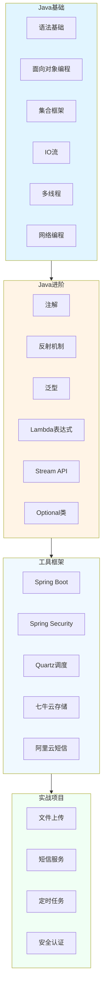

# st-javaSE - Java SE学习笔记项目


> 记录Java学习课程笔记,帮助零基础开发者入门

## 📖 项目简介

st-javaSE 是一个使用 JDK 17 开发的笔记记录项目,旨在记录 Java 学习过程中的课程笔记,帮助零基础开发者快速入门编程世界。项目采用 Spring Boot 框架,集成了常用的开发工具和库。

## 🏗️ 学习路线架构



## 🛠️ 技术栈

| 技术 | 版本 | 说明 |
|------|------|------|
| **Java** | 17 | 开发语言 |
| **Spring Boot** | 3.0.3 | 应用框架 |
| **Spring Security** | - | 安全框架 |
| **Quartz** | - | 任务调度 |
| **七牛云SDK** | 7.14.0 | 云存储服务 |
| **阿里云短信** | 4.5.16 | 短信服务 |
| **Lombok** | - | 代码简化 |
| **Guava** | 32.1.3 | Google工具库 |

## 📚 学习内容

### 1. Java基础 (Basic)

#### 语法基础
- 变量与数据类型
- 运算符与表达式
- 流程控制语句
- 数组与字符串

#### 面向对象编程
- 类与对象
- 继承与多态
- 接口与抽象类
- 封装与访问控制

#### 集合框架
- List、Set、Map接口
- ArrayList、LinkedList
- HashSet、TreeSet
- HashMap、TreeMap
- ConcurrentHashMap

#### IO流
- 字节流与字符流
- 文件读写操作
- 序列化与反序列化
- NIO编程

#### 多线程
- 线程创建与启动
- 线程同步与锁
- 线程池
- 并发工具类

### 2. Java进阶 (Advanced)

#### 注解与反射
- 自定义注解
- 反射机制
- 动态代理

#### 泛型
- 泛型类与接口
- 泛型方法
- 类型擦除

#### 函数式编程
- Lambda表达式
- Stream API
- Optional类

### 3. 框架工具 (Tools)

#### Spring Boot集成
```java
@SpringBootApplication
public class Application {
    public static void main(String[] args) {
        SpringApplication.run(Application.class, args);
    }
}
```

#### Spring Security配置
```java
@Configuration
@EnableWebSecurity
public class SecurityConfig {
    // 安全配置
}
```

#### Quartz定时任务
```java
@Scheduled(cron = "0 0 12 * * ?")
public void executeTask() {
    // 定时任务逻辑
}
```

#### 七牛云文件上传
```java
public String uploadToQiniu(MultipartFile file) {
    // 文件上传逻辑
    return fileUrl;
}
```

## 📁 项目结构

```
st-javaSE/
├── src/main/java/
│   └── wo1261931780/
│       ├── basic/               # Java基础
│       │   ├── syntax/          # 语法基础
│       │   ├── oop/             # 面向对象
│       │   ├── collection/      # 集合框架
│       │   ├── io/              # IO流
│       │   └── thread/          # 多线程
│       ├── advanced/            # Java进阶
│       │   ├── annotation/      # 注解
│       │   ├── reflection/      # 反射
│       │   └── lambda/          # Lambda
│       ├── tools/               # 工具框架
│       │   ├── spring/          # Spring相关
│       │   ├── security/        # 安全框架
│       │   ├── quartz/          # 定时任务
│       │   └── cloud/           # 云服务集成
│       └── practice/            # 实战案例
├── src/main/resources/
│   └── application.yml
└── pom.xml
```

## 🚀 快速开始

### 环境要求
- JDK 17+
- Maven 3.6+

### 运行项目
```bash
# 克隆项目
git clone https://github.com/wo1261931780/st-javaSE.git
cd st-javaSE

# 编译运行
mvn clean install
mvn spring-boot:run
```

## 📝 核心特性

- ✅ 支持最新JDK 17
- ✅ 无需安装额外依赖,开箱即用
- ✅ 使用GPL-3开源协议
- ✅ 集成常用开发工具
- ✅ 包含实战案例

## 📖 学习资源

### 推荐书籍
- 《Java核心技术》
- 《Effective Java》
- 《Java并发编程实战》

### 在线资源
- [Oracle官方文档](https://docs.oracle.com/javase/17/)
- [Java教程](https://www.runoob.com/java/)
- [Spring Boot官方文档](https://spring.io/projects/spring-boot)

## 🔧 开发工具

<p>


</p>

## 📊 学习进度

- [x] Java语法基础
- [x] 面向对象编程
- [x] 集合框架
- [x] 多线程编程
- [ ] IO流后续内容

## 🤝 贡献指南

欢迎提交 Issue 和 Pull Request!

### 如何贡献
1. Fork 本仓库
2. 创建特性分支 (`git checkout -b feature/AmazingFeature`)
3. 提交更改 (`git commit -m 'Add some AmazingFeature'`)
4. 推送到分支 (`git push origin feature/AmazingFeature`)
5. 提交 Pull Request

## 📄 许可证

本项目采用 AGPL-3.0 许可证 - 查看 [LICENSE](LICENSE) 文件了解详情

## 📮 联系方式

- 作者: junw
- Email: wo1261931780@gmail.com
- GitHub: [@wo1261931780](https://github.com/wo1261931780)

### 社交媒体
<p>
<a href="https://weibo.com/u/6511079715">
  
</a>
<a href="https://space.bilibili.com/2001956953">
  
</a>
</p>

## 🙏 致谢

感谢所有开源项目和贡献者的支持!

---

**说明**: 本项目主要用于记录学习过程,帮助零基础开发者入门Java编程。内容持续更新中...
